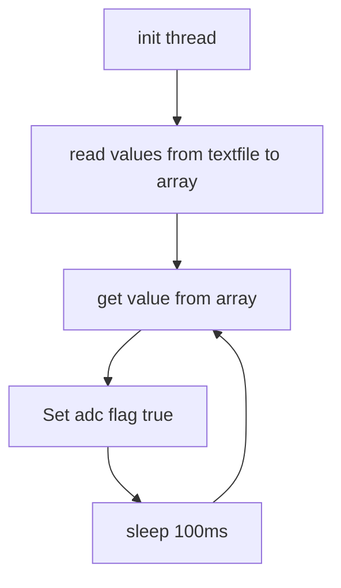
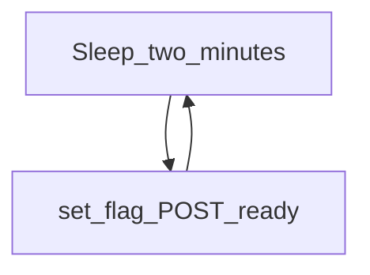
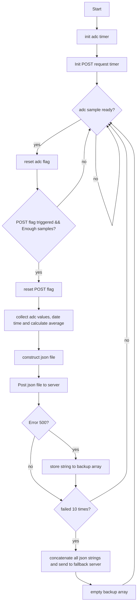

# Logic of the code

## Analog to digital converter and related code

Measurement.txt is read into an array, from there a thread called
> void *readADCTimer(void *filename)

reads out a value one by one, and wraps over to the beginning when it has reached the end
The threads also sets a flag to true to signal an if test in main() that a sample is ready to be read.

I have done this to simulate how an interrupt routine runs on an embedded system that talks with an external
adc. Every time a sample arrives, it is converted to celsius. The values are summed up, number of samples counterd, max, min is found.
When a POST flag is triggered, average is calculated

## POST request
Everytime there is time to send a a new POST request, a flag is set in the thread

>void *pubToPOST(void *vargp)

In main there is a test for that flag, and when it is triggered the calculations are done on the data, a json string is constructed and sent to
the server. If the server failes, the json string is stored in an array, and when there is 10 elements in the array, this is sent to the
fallback server and the array is emptied. 

##Compiling
There is a makefile and also a tasks.json file if vscode is used. Dependencies are GCC and curl

# Flow charts

## ADC "interrupt" thread readADCTimer

## POST request thread

## main()

